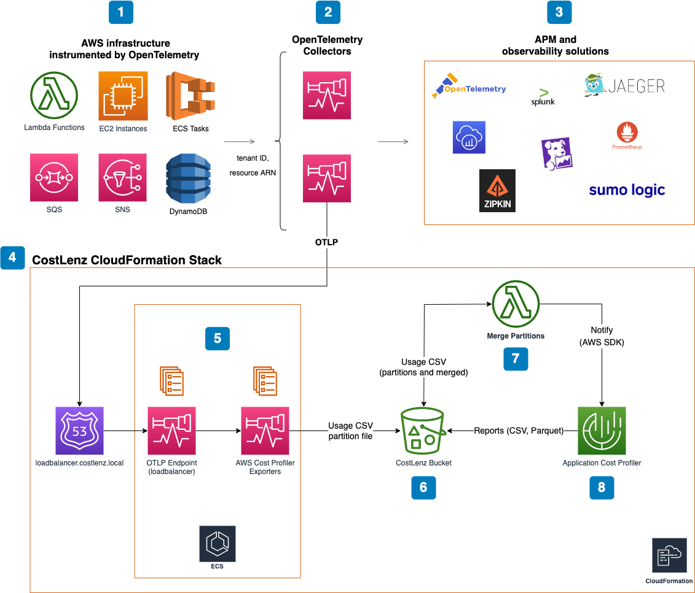

# CostLenz

CostLenz tracks AWS costs per tenant and application by extracting usage data for [AWS Application Cost Profiler](https://aws.amazon.com/ru/aws-cost-management/aws-application-cost-profiler/) from [OpenTelemetry](https://opentelemetry.io/) traces.

AWS Cost Explorer allows analyzing costs using a variety of dimensions, like services, regions, resources, but it doesn't allow to see costs with better granularity. It [may be important](https://aws.amazon.com/ru/blogs/apn/calculating-tenant-costs-in-saas-environments/) to track costs per tenant in multi-tenant SaaS environments and in 2021 [AWS Application Cost Profiler](https://aws.amazon.com/ru/aws-cost-management/aws-application-cost-profiler/) service was introduced.

AWS Application Cost Profiler allows customers, running multi-tenant applications, to get granular cost breakdown of shared AWS resources across tenant base. This service is great, and it works like a black box that ingest usage data and generates reports in CSV or Parquet format with resource usage grouped by tenant or application IDs. But still you need to generate usage data, and this is far from being easy! You need to instrument your code somehow to generate input data for the Application Cost Profiler. Also, configuring this service itself may be a [tedious and error-prone process](https://docs.aws.amazon.com/application-cost-profiler/latest/userguide/introduction.html).

Here comes The CostLenz to help. The CostLenz integrates OpenTelemetry infrastructure (you may already have your services instrumented with it) with the AWS Application Cost Profiler and configures it in proper, secure and efficient way.

## Distribution

The CostLenz [is available](https://aws.amazon.com/marketplace/pp/prodview-fmnjbk7ili45c?sr=0-1&ref_=beagle&applicationId=AWS-Marketplace-Console) in AWS Marketplace.

Free 14 day trial is included.

## Architecture
The diagram shows how the CostLenz works and integrates into your own environment:

1. Your cloud AWS infrastructure may already use OpenTelemetry as an observability solution. To use the CostLenz, the existing instrumentation should be modified to send tenant ID and AWS resource ARN as trace span attributes. At the moment Application Cost Profiler tracks costs for: Lambda, EC2, ECS, SQS, SNS and DynamoDB. Using [AWS Distro for OpenTelemetry](https://aws-otel.github.io/) and [Resource Detection Processor](https://github.com/open-telemetry/opentelemetry-collector-contrib/tree/main/processor/resourcedetectionprocessor) makes resource ARN extraction for the mentioned AWS services fully automatic. So you only need to provide a tenant ID as a trace span attribute.

2. Code instrumented with OpenTelemetry sends metrics, logs and traces to one or more OTEL collectors, that may be configured to process this data and send it to other collectors or APM and observability services. Since traces from AWS contain sufficient information to track costs, OTEL collectors may be configured to send traces to CostLenz OTLP endpoint loadbalancer.costlenz.local.

3. OpenTelemetry can export metrics, logs and traces to different targets, like Splunk, Jaeger, X-Ray, DataDog, Zipkin etc. The CostLenz works just as a one more OpenTelemetry system to export traces to.

4. The CostLenz is defined using AWS CloudFormation and can be deployed in just a few clicks. It should be deployed in the same VPC as your infrastructure.

5. The CostLenz core runs in AWS ECS Fargate cluster and contains two services. First service works as OTEL collector that balances incoming traces for the second service that contains one or more OTEL collectors (AWS Cost Profiler Exporter) that export usage data in the Application Cost Profiler CSV format to the S3 bucket as partition usage file. This service configured to scale automatically when CPU utilization is high. Collectors are build as the fork of the [OpenTelemetry Collector Contrib](https://github.com/open-telemetry/opentelemetry-collector-contrib) project. We added a new exporter "awscostprofiler" that allows it to convert traces into Application Cost Profiler usage files. Also, we added new functionality into "groupbytrace" processor that allows copying specified attribute values across all spans in the trace (this way tenant ID attribute has only to be set once for the root span).

6. The CostLenz creates S3 bucket to store partition usage files, intermediary data and reports from AWS Application Cost Profiler.

7. Lambda function runs hourly and merges partition usages files into a single usage file and notifies AWS Application Cost Profiler about it.

8. The AWS Application Cost Profiler generates reports in CSV or Parquet formats daily/monthly and writes them into the S3 bucket.

## Known Limitations

1. At the moment the AWS Application Cost Profiler tracks cost information only for EC2, ECS, Lambda, SQS, SNS and DynamoDB.
2. Hourly usage data file hard limit for AWS Application Cost Profiler is only 10Mb, and it may be a blocker for production usage. We work with AWS to make this limit tunable.
3. NAT Gateway internet access is required to deploy and run CostLenz in a private subnet (it requires access to AWS SDK endpoints and DockerHub registry).

## Installation

1. Get a CostLenz subscription at [AWS Marketplace](http://aws.amazon.com/marketplace/pp/B09YHQ2D3Z). Free trial is available.

2. Make sure your AWS IAM user has permissions to create resources specified in the CostLenz [template](./costlenz.yaml).

3. In your AWS console go to CloudFormation / "Create stack with new resources (standard)", then select "Template is ready" and "Upload a template file". [Download](./costlenz.yaml) and Select CostLenz CloudFormation template and press Next.

4. Fill the stack name.

5. Select the VPC where your AWS infrastructure is deployed.

6. Select the subnet in your VPC. See [Known Limitations](#known-limitations) for private subnets.

7. Select collector task size from allowed ECS task vCPU and memory sizes. Set initial desired and maximum tasks count.

8. Select loadbalancer task size from allowed ECS task vCPU and memory sizes.

9. Fill the OpenTelemetry Span Attributes section. It contains names of trace span attributes that will be used by CostLenz to extract information about tenant, application and resource IDs.

10. Fill the Application Cost Profiler section. Select report generation frequency (monthly/daily/all), report output format (CSV or Parquet), reports files expiration and email for getting notification and errors from Application Cost Profiler.

11. Press Next, configure other stack options if you would like, then press Next, review parameters, set "I acknowledge that AWS CloudFormation might create IAM resources." and press "Create stack".

12. Wait until the stack is ready with "CREATE_COMPLETE" status.

## Troubleshooting

1. If the stack installation fails it automatically rolls back. 
2. See "Events" tab for the resources that failed. 
3. Logs in the CloudWatch log group created by stack may contain error details from task containers.

## Instrumentation

Trace spans from the code instrumented with OpenTelemetry must report the following attributes to be captured by CostLenz:

* application ID
* tenant ID
* resource ID (ARN)

If any of these attributes are not available then trace span is ignored by CostLenz. The names of these attributes should be specified as parameters during stack creation:

* ApplicationIdAttr (default value "application_id")
* TenantIdAttr (default value "tenant_id")
* ResourceIdAttr (default value "resource_id")

### Application ID

Required attribute.

Identifies the application or product in your system that is being used. Defines the scope of the tenant metadata. CostLenz extracts application ID from the trace span attribute or just use the default value if it was specified as parameter "DefaultApplicationId" during the stack creation.

Propagated. It means that you may set the attribute only for parent span. CostLenz automatically copies that attribute across all children spans.

### Tenant ID

Required attribute.

An identifier in your system for the tenant who is consuming the specified resource. Application Cost Profiler aggregates to this level within the application ID.

Propagated. It means that you may set the attribute only for parent span. CostLenz automatically copies that attribute across all children spans.

### Resource ID (ARN)

Required attribute.

Amazon Resource Name (ARN) for resource being used. At the moment only EC2 instance, ECS task, Lambda, SQS queue, SNS topic and DynamoDB table are ARNs supported.

CostLenz searches for specific trace span attributes that represent resource ID and set by supported instrumentation libraries (see the full list of libraries below). 

If your code is not instrumented with one of supported instrumentation libraries, you have to set Resource ID (ARN) attribute value manually.

Supported OpenTelemetry libraries and packages:

#### AWS Distro for OpenTelemetry

This [OpenTelemetry distribution](https://aws-otel.github.io/) allows instrumenting Lambda and AWS SDK libraries easily with [AWS managed Lambda layer](https://aws-otel.github.io/docs/getting-started/lambda) and allows to automatically capture usage data for Lambda, SQS, SNS and DynamoDB. See [example](#instrumentation-example) of such instrumentation.

#### Botocore Instrumentor 

This Python [package](https://github.com/open-telemetry/opentelemetry-python-contrib/tree/main/instrumentation/opentelemetry-instrumentation-botocore) allows to capture boto3/botocore calls and usage data for SQS, SNS and DynamoDB. Used internally by [AWS Distro for OpenTelemetry](#aws-distro-for-opentelemetry).

#### Resource Detection Processor

This OpenTelemetry collector [processor](https://github.com/open-telemetry/opentelemetry-collector-contrib/tree/main/processor/resourcedetectionprocessor) allows detection of EC2 instance ID and ECS task ARN. This information automatically processed by CostLenz to extract resource ID. This processor should be run on the same machine with instrumented code to detect instance ID or ECS task ARN properly.

## Instrumentation Example

[Example stack](./example) can be deployed using AWS CDK and shows Lambda that use SQS and instrumented with [AWS Distro for OpenTelemetry](https://aws-otel.github.io/). This Lambda is configured to send traces to the CostLenz endpoint so Lambda and SQS usage data is captured. To run it:

**Important** Since Lambda function in this example uses SQS and connects to the VPC, make sure that the SQS [interface endpoint](https://docs.aws.amazon.com/vpc/latest/privatelink/privatelink-access-aws-services.html) is configured and the endpoint security group allows connection from the Lambda security group (both for public and private subnets). It's not required when deploying into a private subnet with internet access via NAT Gateway.

1. Make sure AWS CDK CLI is [installed](htt//docs.aws.amazon.com/cdk/v2/guide/cli.html) on your machine.
2. Make sure Python Poetry is [installed](https://python-poetry.org/) on your machine.
3. Make sure the CostLenz is [installed](#installation).
4. Install project dependencies with `poetry install`
5. Activate Python environment with `poetry shell`
6. Deploy the example stack using `cdk deploy --parameters vpcId=<vpc_id> --parameters subnetId=<subnet_id>` command. Specify CostLenz VPC and subnet inside it. Copy API Gateway endpoint URL from the command output.
7. Call Lambda using the endpoint URL, for example `curl -X GET "https://xxxxxxxx.execute-api.us-east-1.amazonaws.com/prod/lambda1?tenant=1"` multiple times using various tenant IDs. Without `tenant` query string Lambda generates pseudo-random tenant ID in range from 1 to 10.
8. In AWS go to Lambda console, navigate to Lambda log in CloudWatch and make sure that Lambda is called. Also see the output from the OpenTelemetry.
9. In two hours or so check CostLenz S3 bucket and see usage data in "input" and "merged" folders.
10. In 24 hours or so check CostLenz S3 bucket and see reports generated by AWS Application Cost Profiler in "reports" folder. This reports may show zero cost since free tier for Lambda and SQS is not fully used.

## Support

Please contact the CostLenz [support](mailto:costlenz.support@atlasgurus.com) or [create](https://github.com/costlenz/costlenz/issues) a ticket.

